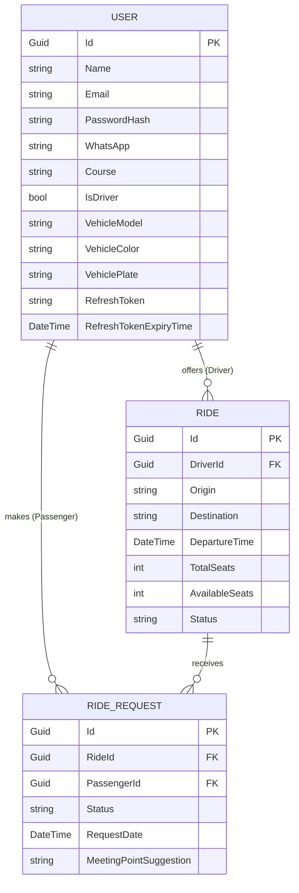
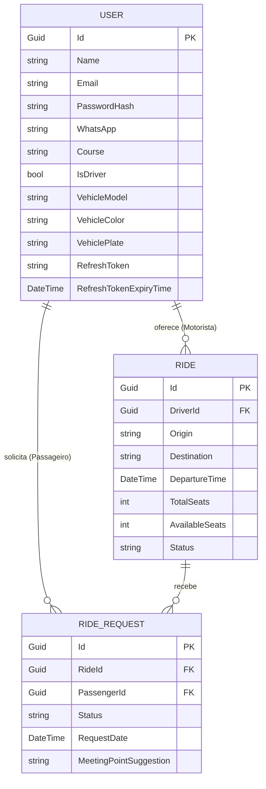

# Kombinado API 🚗

[](https://dotnet.microsoft.com/download/dotnet/8.0)
[](https://www.postgresql.org/)
[](https://www.docker.com/)
[](https://learn.microsoft.com/en-us/ef/core/)
[](https://jwt.io/)

Kombinado API is the production-ready backend service powering **Kombinado**, a collaborative academic carpooling platform. Designed for university campuses, the API enables students and university staff to offer, request, and manage rides efficiently. By sharing commutes, users reduce transportation costs, optimize campus parking, and decrease their carbon footprint while fostering a supportive academic community.

---

> ### 🇧🇷 **Tradução em Português Disponível**
> Se preferir ler esta documentação em português brasileiro, há uma seção completa e detalhada no final deste documento.  
> 👉 [**Clique aqui para ir direto para a versão em Português**](#portuguese-version)

---

## <a id="table-of-contents"></a>📖 Table of Contents
1. [Core Features & Workflow](#core-features)
2. [Domain Architecture & Database Schema](#domain-architecture)
3. [Technology Stack](#technology-stack)
4. [Prerequisites & Setup](#prerequisites-setup)
5. [How to Run the Project](#how-to-run)
6. [API Specification & Endpoints](#api-specification)
   - [Standard API Response Shape](#api-response-shape)
   - [Authentication Domain (`api/Auth`)](#auth-domain)
   - [Rides Domain (`api/Rides`)](#rides-domain)
   - [Ride Requests Domain (`api/requests`)](#requests-domain)
7. [Portuguese Translation Version](#portuguese-version)

---

## <a id="core-features"></a>🌟 Core Features & Workflow

The platform defines two major user roles based on their registration profile:
* **Drivers**: Users with registered vehicles who can create rides, specify origins/destinations, departure times, and manage passenger seat requests (accepting/rejecting them).
* **Passengers**: Authenticated users who can search for available rides, suggest meeting points, request seats, and track the status of their requests.

### Key Workflows:
1. **Academic Onboarding**: Sign up using standard details. Users who intend to drive must register their vehicle model, color, and license plate.
2. **Ride Creation**: Drivers register a ride with available seats. The system initializes the ride status to **Open ("Aberta")**.
3. **Seat Request**: Passengers browse available rides and request a seat. A request is created in **Pending ("Pendente")** status.
4. **Approval Cycle**: The driver views pending requests for their ride and responds. 
   - If accepted, the ride's available seats counter decrements. If available seats reach zero, the ride status auto-advances to **Full ("Lotada")**.
   - If rejected, the request status is updated to **Rejected ("Recusada")**, and the passenger is notified via the API status.
5. **Ride & Request Cancellation**: 
   - If a driver cancels a ride, all accepted/pending requests are automatically transitioned to **Canceled ("Cancelada")**.
   - Passengers can cancel their seat requests, returning the seat back to the pool if already accepted. However, **accepted requests cannot be canceled if the ride's departure time is within 15 minutes**.

---

## <a id="domain-architecture"></a>🗺️ Domain Architecture & Database Schema

The domain relationships are structured through three primary Entity Models under Entity Framework Core:



### Domain Status Enums

#### 🚗 Ride Status (`RideStatus`)
* **Open ("Aberta")**: Ride has available seats and is visible to passengers.
* **Full ("Lotada")**: Ride has filled all available seats.
* **Completed ("Concluída")**: The trip has finished successfully.
* **Canceled ("Cancelada")**: The driver canceled the trip.

#### 📩 Ride Request Status (`RideRequestStatus`)
* **Pending ("Pendente")**: Request is awaiting driver's review.
* **Accepted ("Aceita")**: Driver approved the request; seat is reserved.
* **Rejected ("Recusada")**: Driver declined the request.
* **Cancelled ("Cancelada")**: Passenger retracted the request.

---

## <a id="technology-stack"></a>🛠️ Technology Stack
* **Runtime**: [.NET 8 SDK](https://dotnet.microsoft.com/download/dotnet/8.0) (ASP.NET Core Web API)
* **Object-Relational Mapper**: [Entity Framework Core (EF Core)](https://learn.microsoft.com/en-us/ef/core/)
* **Database**: [PostgreSQL](https://www.postgresql.org/)
* **Containerization**: [Docker & Docker Compose](https://www.docker.com/) (for running database instances and pgAdmin)
* **Authentication**: [JSON Web Tokens (JWT)](https://jwt.io/) with symmetric key signing and Refresh Token rotation.
* **API Documentation**: Swagger/OpenAPI UI.

---

## <a id="prerequisites-setup"></a>⚙️ Prerequisites & Setup

Ensure the following tools are installed:
* **.NET 8 SDK** (Command-line tools `dotnet` and EF CLI `dotnet ef`)
* **Docker Engine & Docker Compose**

### Environment Configuration (`.env`)
Create a `.env` file in the project root directory (next to `docker-compose.yml`) using the following template:

```env
# 1. PostgreSQL Database Credentials
POSTGRES_USER=postgres
POSTGRES_PASSWORD=postgres
POSTGRES_DB=kombinado_db

# 2. pgAdmin Dashboard Credentials (Optional Database Viewer)
PGADMIN_DEFAULT_EMAIL=admin@kombinado.com
PGADMIN_DEFAULT_PASSWORD=admin

# 3. ASP.NET Core Connection String
CONNECTION_STRING=Host=localhost;Database=kombinado_db;Username=postgres;Password=postgres;Port=5432;

# 4. JWT Authentication Details
JWT_SECRET=your_super_secret_jwt_key_here_must_be_long_enough_at_least_32_characters
JWT_EXPIRE_MINUTES=60
JWT_REFRESH_EXPIRE_DAYS=7
JWT_ISSUER=Kombinado
JWT_AUDIENCE=KombinadoApp
```

---

## <a id="how-to-run"></a>🚀 How to Run the Project

Follow these steps to spin up the entire database and API in less than 5 minutes:

### Step 1: Start the PostgreSQL Database Container
Run Docker Compose from the project root directory:
```bash
docker-compose up -d
```
*This starts a PostgreSQL instance on port `5432` and pgAdmin on port `5050`.*

### Step 2: Navigate to the API Directory
```bash
cd Kombinado.Api
```

### Step 3: Install dependencies and apply EF Migrations
Ensure the EF tools are installed, then run the migration script to configure database schemas:
```bash
dotnet ef database update
```

### Step 4: Launch the API
```bash
dotnet run
```
The terminal will display the active listening URLs (typically `http://localhost:5000` or `https://localhost:5001`).

### Step 5: Explore with Swagger UI
Navigate to the interactive Swagger UI to review and invoke endpoints live:
👉 `http://localhost:<PORT>/swagger` (e.g., `http://localhost:5000/swagger`)

---

## <a id="api-specification"></a>🔌 API Specification & Endpoints

### <a id="api-response-shape"></a>Standard API Response Shape
All endpoints implement a standardized payload envelope:
```json
{
  "success": true,
  "message": "Operation completed successfully.",
  "data": null,
  "statusCode": 200
}
```

---

### <a id="auth-domain"></a>1. Authentication Domain (`api/Auth`)
Endpoints used to handle user onboarding, token issuance, and token refresh. These do not require authentication.

#### User Sign-up (`POST /api/Auth/signup`)
Registers a new passenger or driver account.
* **Payload Structure (`SignupRequestDto`)**:
  ```json
  {
    "name": "Alex Smith",
    "email": "alex.smith@academic.edu",
    "password": "StrongPassword123!",
    "whatsApp": "5534999998888",
    "course": "Computer Science",
    "isDriver": true,
    "vehicleModel": "Toyota Corolla",
    "vehicleColor": "Silver",
    "vehiclePlate": "ABC1D23"
  }
  ```
  *(Note: Vehicle details are optional but required if `isDriver` is set to `true`).*
* **Response (Success `201 OK`)**:
  ```json
  {
    "success": true,
    "message": "User registered successfully.",
    "data": {
      "accessToken": "eyJhbGciOi...",
      "refreshToken": "7c9f8d...",
      "name": "Alex Smith",
      "isDriver": true
    },
    "statusCode": 201
  }
  ```

#### User Login (`POST /api/Auth/login`)
Authenticates an existing user and returns JWT credentials.
* **Payload Structure (`LoginRequestDto`)**:
  ```json
  {
    "email": "alex.smith@academic.edu",
    "password": "StrongPassword123!"
  }
  ```
* **Response (Success `200 OK`)**: Returns a payload matching the sign-up output.

#### Token Refresh (`POST /api/Auth/refresh`)
Issues a new JWT Access Token when expired by providing a valid Refresh Token.
* **Payload Structure (`RefreshTokenRequestDto`)**:
  ```json
  {
    "accessToken": "eyJhbGciOi...",
    "refreshToken": "7c9f8d..."
  }
  ```
* **Response (Success `200 OK`)**: Generates and returns a rotated token set in the same envelope.

---

### <a id="rides-domain"></a>2. Rides Domain (`api/Rides`)
These endpoints manage ride postings and require `Authorization: Bearer <token>`. Driver-exclusive endpoints validate the claims via a policy.

#### Create a Ride (`POST /api/Rides`)
*🔒 **Requires Driver Role (`DriverOnly` Policy)***
* **Payload Structure (`CreateRideDto`)**:
  ```json
  {
    "origin": "Main Campus - Gate A",
    "destination": "Downtown Terminal",
    "departureTime": "2026-06-01T18:30:00Z",
    "totalSeats": 4
  }
  ```
* **Response (Success `201 Created`)**:
  ```json
  {
    "success": true,
    "message": "Ride created successfully.",
    "data": {
      "id": "a1b2c3d4-e5f6-7a8b-9c0d-1e2f3a4b5c6d",
      "origin": "Main Campus - Gate A",
      "destination": "Downtown Terminal",
      "departureTime": "2026-06-01T18:30:00Z",
      "totalSeats": 4,
      "availableSeats": 4,
      "status": "Aberta"
    },
    "statusCode": 201
  }
  ```

#### Get Available Rides (`GET /api/Rides`)
*🔒 **Requires Authenticated User***
Lists all rides in **Open ("Aberta")** status, excluding rides offered by the active user.
* **Response (Success `200 OK`)**:
  ```json
  {
    "success": true,
    "message": "Available rides retrieved successfully.",
    "data": [
      {
        "id": "a1b2c3d4-e5f6-...",
        "origin": "Main Campus",
        "destination": "Downtown",
        "departureTime": "2026-06-01T18:30:00Z",
        "totalSeats": 4,
        "availableSeats": 2,
        "status": "Aberta",
        "vehicleModel": "Honda Civic",
        "vehicleColor": "Black",
        "vehiclePlate": "XYZ9W87"
      }
    ],
    "statusCode": 200
  }
  ```

#### Get My Offered Rides (`GET /api/Rides/me/driving`)
*🔒 **Requires Driver Role (`DriverOnly` Policy)***
Lists all rides offered by the logged-in driver.
* **Response (Success `200 OK`)**: Same payload format as `GET /api/Rides`.

#### Cancel a Ride (`PATCH /api/Rides/{rideId}/cancel`)
*🔒 **Requires Driver Role (`DriverOnly` Policy)***
Cancels a specific ride and sets its status to `"Cancelada"`.
* **Response (Success `200 OK`)**:
  ```json
  {
    "success": true,
    "message": "Ride canceled successfully.",
    "data": null,
    "statusCode": 200
  }
  ```

---

### <a id="requests-domain"></a>3. Ride Requests Domain (`api/requests`)
Endpoints allowing passengers to coordinate seat booking, and drivers to review and approve/reject bookings. Requires `Authorization: Bearer <token>`.

#### Request a Seat (`POST /api/requests/ride/{rideId}`)
*🔒 **Requires Authenticated User***
Allows a passenger to request a seat on a ride.
* **Payload Structure (`CreateRideRequestDto`)**:
  ```json
  {
    "meetingPointSuggestion": "In front of the library building"
  }
  ```
* **Response (Success `200 OK`)**:
  ```json
  {
    "success": true,
    "message": "Ride request submitted successfully.",
    "data": {
      "id": "8f9e0d1a-2b3c-...",
      "passengerName": "John Doe",
      "status": "Pendente",
      "meetingPointSuggestion": "In front of the library building",
      "phoneNumber": null
    },
    "statusCode": 200
  }
  ```

#### Get My Requests (`GET /api/requests/me`)
*🔒 **Requires Authenticated User***
Retrieves all requests made by the logged-in passenger.
* **Response (Success `200 OK`)**:
  ```json
  {
    "success": true,
    "message": "Your ride requests retrieved successfully.",
    "data": [
      {
        "id": "8f9e0d1a-2b3c-...",
        "rideId": "a1b2c3d4-e5f6-...",
        "driverName": "Jane Doe",
        "status": "Pendente",
        "meetingPointSuggestion": "In front of the library building",
        "phoneNumber": null,
        "origin": "Main Campus",
        "destination": "Downtown",
        "departureTime": "2026-06-01T18:30:00Z",
        "vehicleModel": "Honda Civic",
        "vehicleColor": "Black",
        "vehiclePlate": "XYZ9W87"
      }
    ],
    "statusCode": 200
  }
  ```

#### Cancel Request (`PATCH /api/requests/{requestId}/cancel`)
*🔒 **Requires Authenticated User***
Allows a passenger to retract a pending or accepted seat request.
* **Response (Success `200 OK`)**:
  ```json
  {
    "success": true,
    "message": "Ride request canceled successfully.",
    "data": null,
    "statusCode": 200
  }
  ```

#### Get Requests for a Ride (`GET /api/requests/ride/{rideId}`)
*🔒 **Requires Driver Role (`DriverOnly` Policy)***
Retrieves all requests submitted by passengers for a ride offered by this driver.
* **Response (Success `200 OK`)**: Returns a list of requests submitted for the specified ride.

#### Respond to Seat Request (`PATCH /api/requests/{requestId}/respond`)
*🔒 **Requires Driver Role (`DriverOnly` Policy)***
Allows a driver to accept or decline a passenger's seat booking request.
* **Payload Structure (`RespondRequestDto`)**:
  ```json
  {
    "accept": true
  }
  ```
* **Response (Success `200 OK`)**:
  ```json
  {
    "success": true,
    "message": "Request status updated successfully.",
    "data": null,
    "statusCode": 200
  }
  ```
  *(Status transitions to `"Aceita"` if accepted, or `"Recusada"` if `accept` is false).*

---

## <a id="portuguese-version"></a>🇧🇷 Kombinado API (Versão em Português)

<details>
<summary><b>Clique para expandir a documentação em Português brasileiro</b></summary>

A API do Kombinado é o serviço de backend corporativo da plataforma de carona acadêmica **Kombinado**. Desenvolvido com foco no ambiente universitário, o ecossistema permite que estudantes e servidores compartilhem suas rotas diárias de deslocamento. Ao otimizar o transporte acadêmico, o serviço reduz custos, alivia o tráfego nos estacionamentos internos e apoia as diretrizes de mobilidade sustentável da instituição.

---

## <a id="pt-indice"></a>📖 Índice
1. [Funcionalidades e Fluxo Principal](#pt-funcionalidades)
2. [Arquitetura de Domínio e Banco de Dados](#pt-arquitetura)
3. [Stack Tecnológico](#pt-stack)
4. [Pré-requisitos e Configuração](#pt-prerequisitos)
5. [Como Rodar o Projeto](#pt-como-rodar)
6. [Especificação dos Endpoints da API](#pt-especificacao)

---

## <a id="pt-funcionalidades"></a>Funcionalidades e Fluxo Principal

O sistema reconhece dois perfis de usuários devidamente autenticados:
* **Motoristas**: Usuários que registram dados de veículos e podem cadastrar ofertas de viagens contendo origem, destino, horário de partida e assentos disponíveis. Além disso, gerenciam quem entra no veículo aprovando ou rejeitando solicitações.
* **Passageiros**: Usuários que pesquisam caronas ativas que atendam aos seus destinos, solicitam reservas, propõem pontos de encontro e acompanham o status das suas solicitações.

### Ciclo Operacional:
1. **Cadastro Completo**: Criação da conta com curso acadêmico e contato telefônico. Perfis de motoristas incluem dados detalhados da placa e modelo do veículo.
2. **Postagem de Carona**: Um motorista cria uma carona com assentos vagos. O sistema cria a viagem sob o estado **Aberta**.
3. **Solicitação de Assento**: Um passageiro localiza a carona e submete uma solicitação de reserva informando sugestões de embarque. O pedido entra em status **Pendente**.
4. **Avaliação do Motorista**: O motorista analisa a solicitação pendente através da API:
   - Se **Aceitar**, a vaga é reservada e o número de assentos disponíveis da carona diminui. Caso as vagas cheguem a zero, o status da carona muda para **Lotada**.
   - Se **Recusar**, o status da solicitação atualiza para **Recusada**, permitindo ao passageiro buscar outras opções.
5. **Políticas de Cancelamento**:
   - Se o motorista cancelar a carona, todos os passageiros vinculados têm suas solicitações marcadas automaticamente como **Cancelada**.
   - O passageiro pode remover sua própria reserva, devolvendo a vaga para a carona caso já tenha sido aceita. No entanto, **solicitações aceitas não podem ser canceladas se faltarem menos de 15 minutos para o horário de partida**.

---

## <a id="pt-arquitetura"></a>Arquitetura de Domínio e Banco de Dados

Os relacionamentos de dados estruturados pelas entidades do Entity Framework Core são ilustrados abaixo:



### Estados do Sistema

#### Status da Carona (`RideStatus`)
* **Aberta**: Possui assentos disponíveis e pode ser solicitada por passageiros.
* **Lotada**: Atingiu o limite máximo de assentos ocupados.
* **Concluída**: Viagem finalizada no destino.
* **Cancelada**: Viagem descontinuada pelo motorista.

#### Status da Solicitação (`RideRequestStatus`)
* **Pendente**: Aguardando a aprovação do motorista.
* **Aceita**: Aprovada pelo motorista, assento assegurado.
* **Recusada**: Indeferida pelo motorista.
* **Cancelada**: Desistência manifestada pelo passageiro.

---

## <a id="pt-stack"></a>Stack Tecnológico
* **Ambiente de Execução**: [.NET 8 SDK](https://dotnet.microsoft.com/download/dotnet/8.0) (ASP.NET Core Web API)
* **Mapeamento Objeto-Relacional**: [Entity Framework Core (EF Core)](https://learn.microsoft.com/en-us/ef/core/)
* **Banco de Dados**: [PostgreSQL](https://www.postgresql.org/)
* **Containers**: [Docker & Docker Compose](https://www.docker.com/) (gerenciando banco e pgAdmin local)
* **Segurança e Login**: [JSON Web Tokens (JWT)](https://jwt.io/) com chaves simétricas e fluxo de Refresh Token rotativo.
* **Interface Interativa**: Swagger UI/OpenAPI.

---

## <a id="pt-prerequisitos"></a>Pré-requisitos e Configuração

Certifique-se de instalar as dependências locais:
* **.NET 8 SDK** (incluindo a CLI global `dotnet ef`)
* **Docker & Docker Compose**

### Variáveis de Ambiente (.env)
Adicione o arquivo `.env` na raiz física do repositório (diretório que contém `docker-compose.yml`):

```env
# 1. Credenciais do Banco PostgreSQL
POSTGRES_USER=postgres
POSTGRES_PASSWORD=postgres
POSTGRES_DB=kombinado_db

# 2. Painel pgAdmin (Opcional - Visualizador de Dados)
PGADMIN_DEFAULT_EMAIL=admin@kombinado.com
PGADMIN_DEFAULT_PASSWORD=admin

# 3. Connection String Utilizada pela API
CONNECTION_STRING=Host=localhost;Database=kombinado_db;Username=postgres;Password=postgres;Port=5432;

# 4. Configurações de Assinatura do JWT
JWT_SECRET=sua_chave_secreta_jwt_aqui_deve_ser_longa_e_segura_com_no_minimo_32_caracteres
JWT_EXPIRE_MINUTES=60
JWT_REFRESH_EXPIRE_DAYS=7
JWT_ISSUER=Kombinado
JWT_AUDIENCE=KombinadoApp
```

---

## <a id="pt-como-rodar"></a>Como Rodar o Projeto

Siga este procedimento para subir e estruturar o projeto:

### 1. Iniciar os Containers de Banco de Dados
Na raiz física do projeto, inicialize os serviços no Docker:
```bash
docker-compose up -d
```
*Isto ativará o PostgreSQL na porta `5432` e o pgAdmin na porta `5050`.*

### 2. Acessar o Diretório da API
```bash
cd Kombinado.Api
```

### 3. Aplicar as Migrações do Banco
Crie as tabelas e relacionamentos necessários no PostgreSQL utilizando as migrações automáticas:
```bash
dotnet ef database update
```

### 4. Rodar o Servidor Local
```bash
dotnet run
```
A API iniciará no console informando as portas ativas (como `http://localhost:5000` ou `https://localhost:5001`).

### 5. Acessar Swagger
Consulte e realize chamadas dinâmicas na documentação web interativa:
👉 `http://localhost:<PORTA>/swagger`

---

## <a id="pt-especificacao"></a>Especificação dos Endpoints da API

### Envelope Padrão de Resposta
Todas as saídas de requisição seguem o contrato estruturado abaixo:
```json
{
  "success": true,
  "message": "Operação realizada com sucesso.",
  "data": null,
  "statusCode": 200
}
```

---

### Domínio de Autenticação (`api/Auth`)
Processos públicos para registro de novas credenciais, login de usuários e renovação de tokens de acesso vencidos.

#### Cadastro de Usuário (`POST /api/Auth/signup`)
Criação de novos registros para passageiros ou motoristas.
* **Corpo da Requisição (`SignupRequestDto`)**:
  ```json
  {
    "name": "Maria Silva",
    "email": "maria.silva@academic.edu",
    "password": "SenhaSegura123!",
    "whatsApp": "5534999998888",
    "course": "Engenharia de Software",
    "isDriver": true,
    "vehicleModel": "Toyota Corolla",
    "vehicleColor": "Prata",
    "vehiclePlate": "ABC1D23"
  }
  ```
  *(Nota: Atributos do veículo são opcionais, exceto se `isDriver` for definido como `true`).*
* **Resposta de Sucesso (`201 OK`)**:
  ```json
  {
    "success": true,
    "message": "Usuário registrado com sucesso.",
    "data": {
      "accessToken": "eyJhbGciOi...",
      "refreshToken": "7c9f8d...",
      "name": "Maria Silva",
      "isDriver": true
    },
    "statusCode": 201
  }
  ```

#### Acesso / Login (`POST /api/Auth/login`)
Gera tokens de acesso a partir de e-mail e senha.
* **Corpo da Requisição (`LoginRequestDto`)**:
  ```json
  {
    "email": "maria.silva@academic.edu",
    "password": "SenhaSegura123!"
  }
  ```
* **Resposta de Sucesso (`200 OK`)**: Retorna o token de acesso e refresh no mesmo envelope estruturado.

#### Atualizar Token (`POST /api/Auth/refresh`)
Obtém um novo token de acesso (JWT) fornecendo um token de refresh válido.
* **Corpo da Requisição (`RefreshTokenRequestDto`)**:
  ```json
  {
    "accessToken": "eyJhbGciOi...",
    "refreshToken": "7c9f8d..."
  }
  ```
* **Response (Success `200 OK`)**: Retorna o par de chaves regenerado.

---

### Domínio de Caronas (`api/Rides`)
Controle das ofertas de trajetos rodoviários. Exige cabeçalho `Authorization: Bearer <token>`. Ações exclusivas de motoristas validam a política de acesso correspondente.

#### Cadastrar Oferta de Carona (`POST /api/Rides`)
*🔒 **Apenas Motoristas (`DriverOnly` Policy)***
* **Corpo da Requisição (`CreateRideDto`)**:
  ```json
  {
    "origin": "Portaria Principal - Bloco A",
    "destination": "Terminal Central",
    "departureTime": "2026-06-01T18:30:00Z",
    "totalSeats": 4
  }
  ```
* **Resposta de Sucesso (`201 Created`)**:
  ```json
  {
    "success": true,
    "message": "Carona criada com sucesso.",
    "data": {
      "id": "a1b2c3d4-e5f6-7a8b-9c0d-1e2f3a4b5c6d",
      "origin": "Portaria Principal - Bloco A",
      "destination": "Terminal Central",
      "departureTime": "2026-06-01T18:30:00Z",
      "totalSeats": 4,
      "availableSeats": 4,
      "status": "Aberta"
    },
    "statusCode": 201
  }
  ```

#### Listar Caronas Disponíveis (`GET /api/Rides`)
*🔒 **Qualquer Usuário Autenticado***
Retorna todas as ofertas ativas no estado **Aberta**, ignorando caronas criadas pelo próprio solicitante.
* **Resposta de Sucesso (`200 OK`)**:
  ```json
  {
    "success": true,
    "message": "Caronas recuperadas com sucesso.",
    "data": [
      {
        "id": "a1b2c3d4-e5f6-...",
        "origin": "Portaria Principal - Bloco A",
        "destination": "Terminal Central",
        "departureTime": "2026-06-01T18:30:00Z",
        "totalSeats": 4,
        "availableSeats": 2,
        "status": "Aberta",
        "vehicleModel": "Honda Civic",
        "vehicleColor": "Preto",
        "vehiclePlate": "XYZ9W87"
      }
    ],
    "statusCode": 200
  }
  ```

#### Minhas Caronas Oferecidas (`GET /api/Rides/me/driving`)
*🔒 **Apenas Motoristas (`DriverOnly` Policy)***
Lista os cadastros de carona vinculados ao motorista ativo.
* **Resposta de Sucesso (`200 OK`)**: Retorna lista de caronas estruturada no mesmo envelope.

#### Cancelar uma Carona (`PATCH /api/Rides/{rideId}/cancel`)
*🔒 **Apenas Motoristas (`DriverOnly` Policy)***
Invalida o trajeto e desmarca as vagas preenchidas, definindo o status como `"Cancelada"`.
* **Resposta de Sucesso (`200 OK`)**:
  ```json
  {
    "success": true,
    "message": "Carona cancelada com sucesso.",
    "data": null,
    "statusCode": 200
  }
  ```

---

### Domínio de Solicitações (`api/requests`)
Endpoints dedicados a reservas de assentos por passageiros e deferimento por motoristas. Exige cabeçalho `Authorization: Bearer <token>`.

#### Solicitar Vaga em Carona (`POST /api/requests/ride/{rideId}`)
*🔒 **Qualquer Usuário Autenticado***
Cria um pedido pendente de assento na carona informada.
* **Corpo da Requisição (`CreateRideRequestDto`)**:
  ```json
  {
    "meetingPointSuggestion": "Em frente à biblioteca central"
  }
  ```
* **Resposta de Sucesso (`200 OK`)**:
  ```json
  {
    "success": true,
    "message": "Solicitação enviada com sucesso.",
    "data": {
      "id": "8f9e0d1a-2b3c-...",
      "passengerName": "João Silva",
      "status": "Pendente",
      "meetingPointSuggestion": "Em frente à biblioteca central",
      "phoneNumber": null
    },
    "statusCode": 200
  }
  ```

#### Listar Minhas Solicitações (`GET /api/requests/me`)
*🔒 **Qualquer Usuário Autenticado***
Recupera todos os pedidos de assento criados pelo passageiro logado.
* **Resposta de Sucesso (`200 OK`)**:
  ```json
  {
    "success": true,
    "message": "Solicitações recuperadas com sucesso.",
    "data": [
      {
        "id": "8f9e0d1a-2b3c-...",
        "rideId": "a1b2c3d4-e5f6-...",
        "driverName": "Jane Doe",
        "status": "Pendente",
        "meetingPointSuggestion": "Em frente à biblioteca central",
        "phoneNumber": null,
        "origin": "Portaria Principal",
        "destination": "Terminal Central",
        "departureTime": "2026-06-01T18:30:00Z",
        "vehicleModel": "Honda Civic",
        "vehicleColor": "Preto",
        "vehiclePlate": "XYZ9W87"
      }
    ],
    "statusCode": 200
  }
  ```

#### Cancelar Minha Solicitação (`PATCH /api/requests/{requestId}/cancel`)
*🔒 **Qualquer Usuário Autenticado***
Permite a desistência de um pedido feito previamente pelo passageiro.
* **Resposta de Sucesso (`200 OK`)**:
  ```json
  {
    "success": true,
    "message": "Solicitação cancelada com sucesso.",
    "data": null,
    "statusCode": 200
  }
  ```

#### Listar Solicitações de uma Carona (`GET /api/requests/ride/{rideId}`)
*🔒 **Apenas Motoristas (`DriverOnly` Policy)***
Retorna os pedidos submetidos para uma viagem criada pelo motorista logado.
* **Resposta de Sucesso (`200 OK`)**: Lista de solicitações de assento enviadas para a carona.

#### Responder a uma Solicitação (`PATCH /api/requests/{requestId}/respond`)
*🔒 **Apenas Motoristas (`DriverOnly` Policy)***
Deferimento (Aceite ou Recusa) de reservas sob a ótica do motorista.
* **Corpo da Requisição (`RespondRequestDto`)**:
  ```json
  {
    "accept": true
  }
  ```
* **Resposta de Sucesso (`200 OK`)**:
  ```json
  {
    "success": true,
    "message": "Situação do pedido atualizada com sucesso.",
    "data": null,
    "statusCode": 200
  }
  ```
  *(Status transita para `"Aceita"` ou `"Recusada"`, conforme o campo `accept`).*

</details>