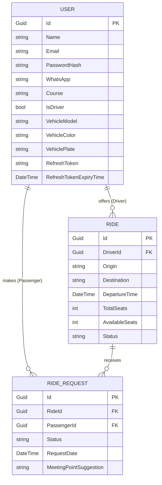
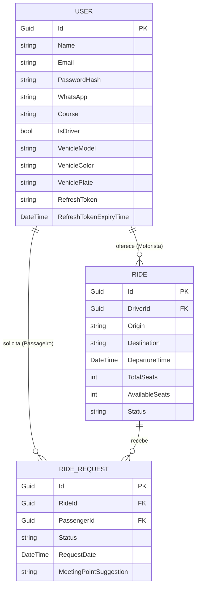

# Kombinado API 🚗

[](https://dotnet.microsoft.com/download/dotnet/8.0)
[](https://www.postgresql.org/)
[](https://www.docker.com/)
[](https://learn.microsoft.com/en-us/ef/core/)
[](https://jwt.io/)

Kombinado API is the production-ready backend service powering **Kombinado**, a collaborative academic carpooling platform. Designed for university campuses, the API enables students and university staff to offer, request, and manage rides efficiently. By sharing commutes, users reduce transportation costs, optimize campus parking, and decrease their carbon footprint while fostering a supportive academic community.

---

> ### 🇧🇷 **Tradução em Português Disponível**
> Se preferir ler esta documentação em português brasileiro, há uma seção completa e detalhada no final deste documento.  
> 👉 [**Clique aqui para ir direto para a versão em Português**](#portuguese-version)

---

## <a id="table-of-contents"></a>📖 Table of Contents
1. [Core Features & Workflow](#core-features)
2. [Domain Architecture & Database Schema](#domain-architecture)
3. [Technology Stack](#technology-stack)
4. [Prerequisites & Setup](#prerequisites-setup)
5. [How to Run the Project](#how-to-run)
6. [API Specification & Endpoints](#api-specification)
   - [Standard API Response Shape](#api-response-shape)
   - [Authentication Domain (`api/Auth`)](#auth-domain)
   - [Rides Domain (`api/Rides`)](#rides-domain)
   - [Ride Requests Domain (`api/requests`)](#requests-domain)
7. [Portuguese Translation Version](#portuguese-version)

---

## <a id="core-features"></a>🌟 Core Features & Workflow

The platform defines two major user roles based on their registration profile:
* **Drivers**: Users with registered vehicles who can create rides, specify origins/destinations, departure times, and manage passenger seat requests (accepting/rejecting them).
* **Passengers**: Authenticated users who can search for available rides, suggest meeting points, request seats, and track the status of their requests.

### Key Workflows:
1. **Academic Onboarding**: Sign up using standard details. Users who intend to drive must register their vehicle model, color, and license plate. E-mails are case-insensitive: they are stored trimmed and in lowercase, so `Alex@...` and `alex@...` are the same account.
2. **Ride Creation**: Drivers register a ride with available seats and a **future** departure time. The system initializes the ride status to **Open ("Aberta")**. See [Departure time rules](#departure-time-rules).
3. **Seat Request**: Passengers browse available rides (only rides that have not departed yet) and request a seat. A request is created in **Pending ("Pendente")** status.
   - A passenger who **canceled** their request can request a seat on the same ride again.
   - A passenger whose request was **rejected** cannot request a seat on the same ride again.
4. **Approval Cycle**: The driver views pending requests for their ride and responds. Requests can no longer be accepted once the ride has departed.
   - If accepted, the ride's available seats counter decrements. If available seats reach zero, the ride status auto-advances to **Full ("Lotada")**.
   - If rejected, the request status is updated to **Rejected ("Recusada")**, and the passenger is notified via the API status.
5. **Ride & Request Cancellation**: 
   - If a driver cancels a ride, all accepted/pending requests are automatically transitioned to **Canceled ("Cancelada")**.
   - Passengers can cancel their seat requests, returning the seat back to the pool if already accepted. However, **accepted requests cannot be canceled if the ride's departure time is within 15 minutes**.

---

## <a id="domain-architecture"></a>🗺️ Domain Architecture & Database Schema

The domain relationships are structured through three primary Entity Models under Entity Framework Core:


```mermaid
erDiagram
    USER ||--o{ RIDE : "offers (Driver)"
    USER ||--o{ RIDE_REQUEST : "makes (Passenger)"
    RIDE ||--o{ RIDE_REQUEST : "receives"

    USER {
        Guid Id PK
        string Name
        string Email
        string PasswordHash
        string WhatsApp
        string Course
        bool IsDriver
        string VehicleModel
        string VehicleColor
        string VehiclePlate
        string RefreshToken
        DateTime RefreshTokenExpiryTime
    }

    RIDE {
        Guid Id PK
        Guid DriverId FK
        string Origin
        string Destination
        DateTime DepartureTime
        int TotalSeats
        int AvailableSeats
        string Status
    }

    RIDE_REQUEST {
        Guid Id PK
        Guid RideId FK
        Guid PassengerId FK
        string Status
        DateTime RequestDate
        string MeetingPointSuggestion
    }
```

### Domain Status Enums

#### 🚗 Ride Status (`RideStatus`)
* **Open ("Aberta")**: Ride has available seats and is visible to passengers.
* **Full ("Lotada")**: Ride has filled all available seats.
* **Completed ("Concluída")**: The trip has finished successfully.
* **Canceled ("Cancelada")**: The driver canceled the trip.

#### 📩 Ride Request Status (`RideRequestStatus`)
* **Pending ("Pendente")**: Request is awaiting driver's review.
* **Accepted ("Aceita")**: Driver approved the request; seat is reserved.
* **Rejected ("Recusada")**: Driver declined the request.
* **Cancelled ("Cancelada")**: Passenger retracted the request.

---

## <a id="technology-stack"></a>🛠️ Technology Stack
* **Runtime**: [.NET 8 SDK](https://dotnet.microsoft.com/download/dotnet/8.0) (ASP.NET Core Web API)
* **Object-Relational Mapper**: [Entity Framework Core (EF Core)](https://learn.microsoft.com/en-us/ef/core/)
* **Database**: [PostgreSQL](https://www.postgresql.org/)
* **Containerization**: [Docker & Docker Compose](https://www.docker.com/) (runs the API, PostgreSQL and pgAdmin with a single command)
* **Authentication**: [JSON Web Tokens (JWT)](https://jwt.io/) with symmetric key signing and Refresh Token rotation.
* **API Documentation**: Swagger/OpenAPI UI.

---

## <a id="prerequisites-setup"></a>⚙️ Prerequisites & Setup

Ensure the following tools are installed:
* **Docker Engine & Docker Compose v2** (the `docker compose` command) — this is all you need to run the project.
* **.NET 8 SDK** and the EF CLI (`dotnet ef`) — only needed to run/debug the API outside Docker or to create new migrations.

### Environment Configuration (`.env`)
Copy `.env.example` to `.env` in the project root directory (next to `docker-compose.yaml`) and fill in the values:
```bash
cp .env.example .env
```

```env
# 1. PostgreSQL Database Credentials
POSTGRES_USER=postgres
POSTGRES_PASSWORD=postgres
POSTGRES_DB=kombinado_db

# 2. pgAdmin Dashboard Credentials (Optional Database Viewer)
PGADMIN_DEFAULT_EMAIL=admin@kombinado.com
PGADMIN_DEFAULT_PASSWORD=admin

# 3. ASP.NET Core Connection String (only used when running the API outside Docker)
CONNECTION_STRING=Host=localhost;Database=kombinado_db;Username=postgres;Password=postgres;Port=5432;

# 4. JWT Authentication Details
JWT_SECRET=your_super_secret_jwt_key_here_must_be_long_enough_at_least_32_characters
JWT_EXPIRE_MINUTES=60
JWT_REFRESH_EXPIRE_DAYS=7
JWT_ISSUER=Kombinado
JWT_AUDIENCE=KombinadoApp
```
* `JWT_SECRET` must have **at least 32 characters**.
* Inside Docker Compose, the API builds its own connection string from the `POSTGRES_*` variables (pointing to the `db` service), so `CONNECTION_STRING` only matters for [Option 2](#run-locally).
* If a required variable is missing, `docker compose` stops before starting and tells you which one.

---

## <a id="how-to-run"></a>🚀 How to Run the Project

### Option 1 — Docker Compose (recommended)
A single command builds the API image, starts PostgreSQL and pgAdmin, waits until the database is healthy and **applies the EF Core migrations automatically**:
```bash
docker compose up -d --build
```

| Service | Address |
|---|---|
| API | `http://localhost:8080` |
| Swagger UI | `http://localhost:8080/swagger` |
| pgAdmin | `http://localhost:5050` |
| PostgreSQL | `localhost:5432` |

Useful commands:
```bash
docker compose logs -f api      # follow the API logs
docker compose up -d --build    # rebuild the API image after changing the code
docker compose down             # stop everything (database data is kept)
docker compose down -v          # stop everything and ERASE the database volume
```
> Without `--build`, Compose reuses the previously built image — code changes only show up after a rebuild.

### <a id="run-locally"></a>Option 2 — API on your machine (debugging in Rider / VS Code)
1. Start only the database:
   ```bash
   docker compose up -d db
   ```
2. Apply the migrations. Run it **from `Kombinado.Api/`**, because the API loads the `.env` from the parent directory:
   ```bash
   cd Kombinado.Api
   dotnet ef database update
   ```
3. Start the API with the **`http`** launch profile (in Rider, pick the `http` run configuration):
   ```bash
   dotnet run --launch-profile http
   ```
   The API runs at `http://localhost:5198` (Swagger: `http://localhost:5198/swagger`). Avoid the `https` profile: it redirects to a self-signed certificate that Postman and Android reject.

### <a id="mobile-app"></a>Connecting the Mobile App (`kombinado-expo`)
The API started by Docker Compose listens on all network interfaces, so the app can reach it. Set `EXPO_PUBLIC_API_URL` in the app's `.env`:
* **Android emulator**: `http://10.0.2.2:8080`
* **Physical device (same Wi-Fi)**: `http://<your-machine-LAN-IP>:8080`

When using Option 2, start the API with `dotnet run --launch-profile http --urls "http://0.0.0.0:5198"` and use port `5198` instead.

---

## <a id="api-specification"></a>🔌 API Specification & Endpoints

### <a id="api-response-shape"></a>Standard API Response Shape
All endpoints implement a standardized payload envelope:
```json
{
  "success": true,
  "message": "Operation completed successfully.",
  "data": null,
  "statusCode": 200
}
```

---

### <a id="auth-domain"></a>1. Authentication Domain (`api/Auth`)
Endpoints used to handle user onboarding, token issuance, and token refresh. These do not require authentication.

#### User Sign-up (`POST /api/Auth/signup`)
Registers a new passenger or driver account.
* **Payload Structure (`SignupRequestDto`)**:
  ```json
  {
    "name": "Alex Smith",
    "email": "alex.smith@academic.edu",
    "password": "StrongPassword123!",
    "whatsApp": "5534999998888",
    "course": "Computer Science",
    "isDriver": true,
    "vehicleModel": "Toyota Corolla",
    "vehicleColor": "Silver",
    "vehiclePlate": "ABC1D23"
  }
  ```
  *(Note: Vehicle details are optional but required if `isDriver` is set to `true`).*
  *(Note: The e-mail is trimmed and converted to lowercase before validation and storage; login accepts any casing).*
* **Response (Success `200 OK`)**: No tokens are returned — call the login endpoint afterwards.
  ```json
  {
    "success": true,
    "message": "Cadastro realizado com sucesso!",
    "data": null,
    "statusCode": 200
  }
  ```

#### User Login (`POST /api/Auth/login`)
Authenticates an existing user and returns JWT credentials.
* **Payload Structure (`LoginRequestDto`)**:
  ```json
  {
    "email": "alex.smith@academic.edu",
    "password": "StrongPassword123!"
  }
  ```
* **Response (Success `200 OK`)**: Returns a payload matching the sign-up output.

#### Token Refresh (`POST /api/Auth/refresh`)
Issues a new JWT Access Token when expired by providing a valid Refresh Token.
* **Payload Structure (`RefreshTokenRequestDto`)**:
  ```json
  {
    "accessToken": "eyJhbGciOi...",
    "refreshToken": "7c9f8d..."
  }
  ```
* **Response (Success `200 OK`)**: Generates and returns a rotated token set in the same envelope.

---

### <a id="rides-domain"></a>2. Rides Domain (`api/Rides`)
These endpoints manage ride postings and require `Authorization: Bearer <token>`. Driver-exclusive endpoints validate the claims via a policy.

#### Create a Ride (`POST /api/Rides`)
*🔒 **Requires Driver Role (`DriverOnly` Policy)***
* **Payload Structure (`CreateRideDto`)**:
  ```json
  {
    "origin": "Main Campus - Gate A",
    "destination": "Downtown Terminal",
    "departureTime": "2026-06-01T15:30:00",
    "totalSeats": 4
  }
  ```
* <a id="departure-time-rules"></a>**Departure time rules**:
  | Format sent | How it is interpreted |
  |---|---|
  | No offset — `"2026-06-01T15:30:00"` | **Brasília time** (`America/Sao_Paulo`), converted to UTC |
  | With offset — `"2026-06-01T15:30:00-03:00"` | Converted to UTC using the given offset |
  | UTC — `"2026-06-01T18:30:00Z"` | Stored as is |

  The departure time is always stored and **returned in UTC** (`Z` suffix) — clients must convert it to local time for display. The three examples above represent the same instant.
* **Errors**: `400` — `"O horário de partida deve ser uma data futura."` when the departure time is not in the future.
* **Response (Success `201 Created`)**:
  ```json
  {
    "success": true,
    "message": "Ride created successfully.",
    "data": {
      "id": "a1b2c3d4-e5f6-7a8b-9c0d-1e2f3a4b5c6d",
      "origin": "Main Campus - Gate A",
      "destination": "Downtown Terminal",
      "departureTime": "2026-06-01T18:30:00Z",
      "totalSeats": 4,
      "availableSeats": 4,
      "status": "Aberta"
    },
    "statusCode": 201
  }
  ```

#### Get Available Rides (`GET /api/Rides`)
*🔒 **Requires Authenticated User***
Lists all rides in **Open ("Aberta")** status with available seats and a departure time still in the future, excluding rides offered by the active user.
* **Response (Success `200 OK`)**:
  ```json
  {
    "success": true,
    "message": "Available rides retrieved successfully.",
    "data": [
      {
        "id": "a1b2c3d4-e5f6-...",
        "origin": "Main Campus",
        "destination": "Downtown",
        "departureTime": "2026-06-01T18:30:00Z",
        "totalSeats": 4,
        "availableSeats": 2,
        "status": "Aberta",
        "vehicleModel": "Honda Civic",
        "vehicleColor": "Black",
        "vehiclePlate": "XYZ9W87"
      }
    ],
    "statusCode": 200
  }
  ```

#### Get My Offered Rides (`GET /api/Rides/me/driving`)
*🔒 **Requires Driver Role (`DriverOnly` Policy)***
Lists all rides offered by the logged-in driver.
* **Response (Success `200 OK`)**: Same payload format as `GET /api/Rides`.

#### Cancel a Ride (`PATCH /api/Rides/{rideId}/cancel`)
*🔒 **Requires Driver Role (`DriverOnly` Policy)***
Cancels a specific ride and sets its status to `"Cancelada"`.
* **Response (Success `200 OK`)**:
  ```json
  {
    "success": true,
    "message": "Ride canceled successfully.",
    "data": null,
    "statusCode": 200
  }
  ```

---

### <a id="requests-domain"></a>3. Ride Requests Domain (`api/requests`)
Endpoints allowing passengers to coordinate seat booking, and drivers to review and approve/reject bookings. Requires `Authorization: Bearer <token>`.

#### Request a Seat (`POST /api/requests/ride/{rideId}`)
*🔒 **Requires Authenticated User***
Allows a passenger to request a seat on a ride.
* **Payload Structure (`CreateRideRequestDto`)**:
  ```json
  {
    "meetingPointSuggestion": "In front of the library building"
  }
  ```
* **Business rules / Errors** (`400` unless noted):
  | Situation | Message |
  |---|---|
  | Ride not found (`404`) | `"Carona não encontrada."` |
  | Ride is not open or has no seats | `"Carona não está disponível para solicitações."` |
  | Ride has already departed | `"Esta carona já partiu."` |
  | Passenger is the ride's driver | `"Você não pode solicitar vaga em sua própria carona."` |
  | Passenger has a **pending** or **accepted** request for this ride | `"Você já solicitou uma vaga para esta carona."` |
  | Passenger's request for this ride was **rejected** | `"Sua solicitação para esta carona foi recusada pelo motorista."` |

  A previously **canceled** request does not block a new one.
* **Response (Success `200 OK`)**:
  ```json
  {
    "success": true,
    "message": "Ride request submitted successfully.",
    "data": {
      "id": "8f9e0d1a-2b3c-...",
      "passengerName": "John Doe",
      "status": "Pendente",
      "meetingPointSuggestion": "In front of the library building",
      "phoneNumber": null
    },
    "statusCode": 200
  }
  ```

#### Get My Requests (`GET /api/requests/me`)
*🔒 **Requires Authenticated User***
Retrieves all requests made by the logged-in passenger.
* **Response (Success `200 OK`)**:
  ```json
  {
    "success": true,
    "message": "Your ride requests retrieved successfully.",
    "data": [
      {
        "id": "8f9e0d1a-2b3c-...",
        "rideId": "a1b2c3d4-e5f6-...",
        "driverName": "Jane Doe",
        "status": "Pendente",
        "meetingPointSuggestion": "In front of the library building",
        "phoneNumber": null,
        "origin": "Main Campus",
        "destination": "Downtown",
        "departureTime": "2026-06-01T18:30:00Z",
        "vehicleModel": "Honda Civic",
        "vehicleColor": "Black",
        "vehiclePlate": "XYZ9W87"
      }
    ],
    "statusCode": 200
  }
  ```

#### Cancel Request (`PATCH /api/requests/{requestId}/cancel`)
*🔒 **Requires Authenticated User***
Allows a passenger to retract a pending or accepted seat request.
* **Response (Success `200 OK`)**:
  ```json
  {
    "success": true,
    "message": "Ride request canceled successfully.",
    "data": null,
    "statusCode": 200
  }
  ```

#### Get Requests for a Ride (`GET /api/requests/ride/{rideId}`)
*🔒 **Requires Driver Role (`DriverOnly` Policy)***
Retrieves all requests submitted by passengers for a ride offered by this driver.
* **Response (Success `200 OK`)**: Returns a list of requests submitted for the specified ride.

#### Respond to Seat Request (`PATCH /api/requests/{requestId}/respond`)
*🔒 **Requires Driver Role (`DriverOnly` Policy)***
Allows a driver to accept or decline a passenger's seat booking request.
* **Payload Structure (`RespondRequestDto`)**:
  ```json
  {
    "accept": true
  }
  ```
* **Response (Success `200 OK`)**:
  ```json
  {
    "success": true,
    "message": "Request status updated successfully.",
    "data": null,
    "statusCode": 200
  }
  ```
  *(Status transitions to `"Aceita"` if accepted, or `"Recusada"` if `accept` is false).*
* **Errors**: `400` — `"Não é possível aceitar esta solicitação, pois a carona já partiu."` when accepting a request after the ride's departure time. Rejecting is still allowed.

---

## <a id="portuguese-version"></a>🇧🇷 Kombinado API (Versão em Português)

<details>
<summary><b>Clique para expandir a documentação em Português brasileiro</b></summary>

A API do Kombinado é o serviço de backend corporativo da plataforma de carona acadêmica **Kombinado**. Desenvolvido com foco no ambiente universitário, o ecossistema permite que estudantes e servidores compartilhem suas rotas diárias de deslocamento. Ao otimizar o transporte acadêmico, o serviço reduz custos, alivia o tráfego nos estacionamentos internos e apoia as diretrizes de mobilidade sustentável da instituição.

---

## <a id="pt-indice"></a>📖 Índice
1. [Funcionalidades e Fluxo Principal](#pt-funcionalidades)
2. [Arquitetura de Domínio e Banco de Dados](#pt-arquitetura)
3. [Stack Tecnológico](#pt-stack)
4. [Pré-requisitos e Configuração](#pt-prerequisitos)
5. [Como Rodar o Projeto](#pt-como-rodar)
6. [Especificação dos Endpoints da API](#pt-especificacao)

---

## <a id="pt-funcionalidades"></a>Funcionalidades e Fluxo Principal

O sistema reconhece dois perfis de usuários devidamente autenticados:
* **Motoristas**: Usuários que registram dados de veículos e podem cadastrar ofertas de viagens contendo origem, destino, horário de partida e assentos disponíveis. Além disso, gerenciam quem entra no veículo aprovando ou rejeitando solicitações.
* **Passageiros**: Usuários que pesquisam caronas ativas que atendam aos seus destinos, solicitam reservas, propõem pontos de encontro e acompanham o status das suas solicitações.

### Ciclo Operacional:
1. **Cadastro Completo**: Criação da conta com curso acadêmico e contato telefônico. Perfis de motoristas incluem dados detalhados da placa e modelo do veículo. O e-mail não diferencia maiúsculas de minúsculas: ele é salvo sem espaços e em minúsculas, então `Maria@...` e `maria@...` são a mesma conta.
2. **Postagem de Carona**: Um motorista cria uma carona com assentos vagos e horário de partida **no futuro**. O sistema cria a viagem sob o estado **Aberta**. Veja as [regras do horário de partida](#pt-regras-horario).
3. **Solicitação de Assento**: Um passageiro localiza a carona (apenas caronas que ainda não partiram aparecem) e submete uma solicitação de reserva informando sugestões de embarque. O pedido entra em status **Pendente**.
   - Quem **cancelou** a própria solicitação pode solicitar vaga novamente na mesma carona.
   - Quem teve a solicitação **recusada** não pode solicitar vaga novamente na mesma carona.
4. **Avaliação do Motorista**: O motorista analisa a solicitação pendente através da API (não é possível aceitar solicitações depois que a carona partiu):
   - Se **Aceitar**, a vaga é reservada e o número de assentos disponíveis da carona diminui. Caso as vagas cheguem a zero, o status da carona muda para **Lotada**.
   - Se **Recusar**, o status da solicitação atualiza para **Recusada**, permitindo ao passageiro buscar outras opções.
5. **Políticas de Cancelamento**:
   - Se o motorista cancelar a carona, todos os passageiros vinculados têm suas solicitações marcadas automaticamente como **Cancelada**.
   - O passageiro pode remover sua própria reserva, devolvendo a vaga para a carona caso já tenha sido aceita. No entanto, **solicitações aceitas não podem ser canceladas se faltarem menos de 15 minutos para o horário de partida**.

---

## <a id="pt-arquitetura"></a>Arquitetura de Domínio e Banco de Dados

Os relacionamentos de dados estruturados pelas entidades do Entity Framework Core são ilustrados abaixo:


```mermaid
erDiagram
    USER ||--o{ RIDE : "oferece (Motorista)"
    USER ||--o{ RIDE_REQUEST : "solicita (Passageiro)"
    RIDE ||--o{ RIDE_REQUEST : "recebe"

    USER {
        Guid Id PK
        string Name
        string Email
        string PasswordHash
        string WhatsApp
        string Course
        bool IsDriver
        string VehicleModel
        string VehicleColor
        string VehiclePlate
        string RefreshToken
        DateTime RefreshTokenExpiryTime
    }

    RIDE {
        Guid Id PK
        Guid DriverId FK
        string Origin
        string Destination
        DateTime DepartureTime
        int TotalSeats
        int AvailableSeats
        string Status
    }

    RIDE_REQUEST {
        Guid Id PK
        Guid RideId FK
        Guid PassengerId FK
        string Status
        DateTime RequestDate
        string MeetingPointSuggestion
    }
```

### Estados do Sistema

#### Status da Carona (`RideStatus`)
* **Aberta**: Possui assentos disponíveis e pode ser solicitada por passageiros.
* **Lotada**: Atingiu o limite máximo de assentos ocupados.
* **Concluída**: Viagem finalizada no destino.
* **Cancelada**: Viagem descontinuada pelo motorista.

#### Status da Solicitação (`RideRequestStatus`)
* **Pendente**: Aguardando a aprovação do motorista.
* **Aceita**: Aprovada pelo motorista, assento assegurado.
* **Recusada**: Indeferida pelo motorista.
* **Cancelada**: Desistência manifestada pelo passageiro.

---

## <a id="pt-stack"></a>Stack Tecnológico
* **Ambiente de Execução**: [.NET 8 SDK](https://dotnet.microsoft.com/download/dotnet/8.0) (ASP.NET Core Web API)
* **Mapeamento Objeto-Relacional**: [Entity Framework Core (EF Core)](https://learn.microsoft.com/en-us/ef/core/)
* **Banco de Dados**: [PostgreSQL](https://www.postgresql.org/)
* **Containers**: [Docker & Docker Compose](https://www.docker.com/) (sobe a API, o PostgreSQL e o pgAdmin com um único comando)
* **Segurança e Login**: [JSON Web Tokens (JWT)](https://jwt.io/) com chaves simétricas e fluxo de Refresh Token rotativo.
* **Interface Interativa**: Swagger UI/OpenAPI.

---

## <a id="pt-prerequisitos"></a>Pré-requisitos e Configuração

Certifique-se de instalar as dependências locais:
* **Docker & Docker Compose v2** (comando `docker compose`) — é tudo o que você precisa para rodar o projeto.
* **.NET 8 SDK** e a CLI `dotnet ef` — necessários apenas para rodar/depurar a API fora do Docker ou criar novas migrações.

### Variáveis de Ambiente (.env)
Copie o `.env.example` para `.env` na raiz do repositório (diretório que contém o `docker-compose.yaml`) e preencha os valores:
```bash
cp .env.example .env
```

```env
# 1. Credenciais do Banco PostgreSQL
POSTGRES_USER=postgres
POSTGRES_PASSWORD=postgres
POSTGRES_DB=kombinado_db

# 2. Painel pgAdmin (Opcional - Visualizador de Dados)
PGADMIN_DEFAULT_EMAIL=admin@kombinado.com
PGADMIN_DEFAULT_PASSWORD=admin

# 3. Connection String (usada apenas ao rodar a API fora do Docker)
CONNECTION_STRING=Host=localhost;Database=kombinado_db;Username=postgres;Password=postgres;Port=5432;

# 4. Configurações de Assinatura do JWT
JWT_SECRET=sua_chave_secreta_jwt_aqui_deve_ser_longa_e_segura_com_no_minimo_32_caracteres
JWT_EXPIRE_MINUTES=60
JWT_REFRESH_EXPIRE_DAYS=7
JWT_ISSUER=Kombinado
JWT_AUDIENCE=KombinadoApp
```
* O `JWT_SECRET` precisa ter **no mínimo 32 caracteres**.
* Dentro do Docker Compose, a API monta a própria connection string a partir das variáveis `POSTGRES_*` (apontando para o serviço `db`), então o `CONNECTION_STRING` só importa na [Opção 2](#pt-rodar-local).
* Se faltar alguma variável obrigatória, o `docker compose` para antes de subir e informa qual é.

---

## <a id="pt-como-rodar"></a>Como Rodar o Projeto

### Opção 1 — Docker Compose (recomendado)
Um único comando gera a imagem da API, sobe o PostgreSQL e o pgAdmin, aguarda o banco ficar saudável e **aplica as migrações do EF Core automaticamente**:
```bash
docker compose up -d --build
```

| Serviço | Endereço |
|---|---|
| API | `http://localhost:8080` |
| Swagger UI | `http://localhost:8080/swagger` |
| pgAdmin | `http://localhost:5050` |
| PostgreSQL | `localhost:5432` |

Comandos úteis:
```bash
docker compose logs -f api      # acompanhar os logs da API
docker compose up -d --build    # gerar a imagem da API de novo após alterar o código
docker compose down             # parar tudo (os dados do banco são mantidos)
docker compose down -v          # parar tudo e APAGAR o volume do banco
```
> Sem o `--build`, o Compose reaproveita a imagem gerada anteriormente — alterações no código só aparecem depois de gerar a imagem de novo.

### <a id="pt-rodar-local"></a>Opção 2 — API na sua máquina (depuração no Rider / VS Code)
1. Suba apenas o banco:
   ```bash
   docker compose up -d db
   ```
2. Aplique as migrações. Rode **dentro de `Kombinado.Api/`**, pois a API carrega o `.env` do diretório pai:
   ```bash
   cd Kombinado.Api
   dotnet ef database update
   ```
3. Inicie a API com o perfil **`http`** (no Rider, escolha a configuração de execução `http`):
   ```bash
   dotnet run --launch-profile http
   ```
   A API roda em `http://localhost:5198` (Swagger: `http://localhost:5198/swagger`). Evite o perfil `https`: ele redireciona para um certificado autoassinado que o Postman e o Android recusam.

### <a id="pt-app-mobile"></a>Conectando o Aplicativo Mobile (`kombinado-expo`)
A API iniciada pelo Docker Compose escuta em todas as interfaces de rede, então o app consegue acessá-la. Configure o `EXPO_PUBLIC_API_URL` no `.env` do app:
* **Emulador Android**: `http://10.0.2.2:8080`
* **Celular físico (mesma rede Wi-Fi)**: `http://<IP-da-sua-máquina-na-rede>:8080`

Ao usar a Opção 2, inicie a API com `dotnet run --launch-profile http --urls "http://0.0.0.0:5198"` e use a porta `5198`.

---

## <a id="pt-especificacao"></a>Especificação dos Endpoints da API

### Envelope Padrão de Resposta
Todas as saídas de requisição seguem o contrato estruturado abaixo:
```json
{
  "success": true,
  "message": "Operação realizada com sucesso.",
  "data": null,
  "statusCode": 200
}
```

---

### Domínio de Autenticação (`api/Auth`)
Processos públicos para registro de novas credenciais, login de usuários e renovação de tokens de acesso vencidos.

#### Cadastro de Usuário (`POST /api/Auth/signup`)
Criação de novos registros para passageiros ou motoristas.
* **Corpo da Requisição (`SignupRequestDto`)**:
  ```json
  {
    "name": "Maria Silva",
    "email": "maria.silva@academic.edu",
    "password": "SenhaSegura123!",
    "whatsApp": "5534999998888",
    "course": "Engenharia de Software",
    "isDriver": true,
    "vehicleModel": "Toyota Corolla",
    "vehicleColor": "Prata",
    "vehiclePlate": "ABC1D23"
  }
  ```
  *(Nota: Atributos do veículo são opcionais, exceto se `isDriver` for definido como `true`).*
  *(Nota: O e-mail é convertido para minúsculas e sem espaços antes da validação e do armazenamento; o login aceita qualquer combinação de maiúsculas/minúsculas).*
* **Resposta de Sucesso (`200 OK`)**: Não retorna tokens — chame o endpoint de login em seguida.
  ```json
  {
    "success": true,
    "message": "Cadastro realizado com sucesso!",
    "data": null,
    "statusCode": 200
  }
  ```

#### Acesso / Login (`POST /api/Auth/login`)
Gera tokens de acesso a partir de e-mail e senha.
* **Corpo da Requisição (`LoginRequestDto`)**:
  ```json
  {
    "email": "maria.silva@academic.edu",
    "password": "SenhaSegura123!"
  }
  ```
* **Resposta de Sucesso (`200 OK`)**: Retorna o token de acesso e refresh no mesmo envelope estruturado.

#### Atualizar Token (`POST /api/Auth/refresh`)
Obtém um novo token de acesso (JWT) fornecendo um token de refresh válido.
* **Corpo da Requisição (`RefreshTokenRequestDto`)**:
  ```json
  {
    "accessToken": "eyJhbGciOi...",
    "refreshToken": "7c9f8d..."
  }
  ```
* **Response (Success `200 OK`)**: Retorna o par de chaves regenerado.

---

### Domínio de Caronas (`api/Rides`)
Controle das ofertas de trajetos rodoviários. Exige cabeçalho `Authorization: Bearer <token>`. Ações exclusivas de motoristas validam a política de acesso correspondente.

#### Cadastrar Oferta de Carona (`POST /api/Rides`)
*🔒 **Apenas Motoristas (`DriverOnly` Policy)***
* **Corpo da Requisição (`CreateRideDto`)**:
  ```json
  {
    "origin": "Portaria Principal - Bloco A",
    "destination": "Terminal Central",
    "departureTime": "2026-06-01T15:30:00",
    "totalSeats": 4
  }
  ```
* <a id="pt-regras-horario"></a>**Regras do horário de partida**:
  | Formato enviado | Como é interpretado |
  |---|---|
  | Sem fuso — `"2026-06-01T15:30:00"` | **Horário de Brasília** (`America/Sao_Paulo`), convertido para UTC |
  | Com fuso — `"2026-06-01T15:30:00-03:00"` | Convertido para UTC usando o fuso informado |
  | UTC — `"2026-06-01T18:30:00Z"` | Salvo como está |

  O horário é sempre armazenado e **retornado em UTC** (sufixo `Z`) — o cliente deve convertê-lo para o horário local ao exibir. Os três exemplos acima representam o mesmo instante.
* **Erros**: `400` — `"O horário de partida deve ser uma data futura."` quando o horário de partida não está no futuro.
* **Resposta de Sucesso (`201 Created`)**:
  ```json
  {
    "success": true,
    "message": "Carona criada com sucesso.",
    "data": {
      "id": "a1b2c3d4-e5f6-7a8b-9c0d-1e2f3a4b5c6d",
      "origin": "Portaria Principal - Bloco A",
      "destination": "Terminal Central",
      "departureTime": "2026-06-01T18:30:00Z",
      "totalSeats": 4,
      "availableSeats": 4,
      "status": "Aberta"
    },
    "statusCode": 201
  }
  ```

#### Listar Caronas Disponíveis (`GET /api/Rides`)
*🔒 **Qualquer Usuário Autenticado***
Retorna todas as ofertas no estado **Aberta**, com vagas disponíveis e horário de partida ainda no futuro, ignorando caronas criadas pelo próprio solicitante.
* **Resposta de Sucesso (`200 OK`)**:
  ```json
  {
    "success": true,
    "message": "Caronas recuperadas com sucesso.",
    "data": [
      {
        "id": "a1b2c3d4-e5f6-...",
        "origin": "Portaria Principal - Bloco A",
        "destination": "Terminal Central",
        "departureTime": "2026-06-01T18:30:00Z",
        "totalSeats": 4,
        "availableSeats": 2,
        "status": "Aberta",
        "vehicleModel": "Honda Civic",
        "vehicleColor": "Preto",
        "vehiclePlate": "XYZ9W87"
      }
    ],
    "statusCode": 200
  }
  ```

#### Minhas Caronas Oferecidas (`GET /api/Rides/me/driving`)
*🔒 **Apenas Motoristas (`DriverOnly` Policy)***
Lista os cadastros de carona vinculados ao motorista ativo.
* **Resposta de Sucesso (`200 OK`)**: Retorna lista de caronas estruturada no mesmo envelope.

#### Cancelar uma Carona (`PATCH /api/Rides/{rideId}/cancel`)
*🔒 **Apenas Motoristas (`DriverOnly` Policy)***
Invalida o trajeto e desmarca as vagas preenchidas, definindo o status como `"Cancelada"`.
* **Resposta de Sucesso (`200 OK`)**:
  ```json
  {
    "success": true,
    "message": "Carona cancelada com sucesso.",
    "data": null,
    "statusCode": 200
  }
  ```

---

### Domínio de Solicitações (`api/requests`)
Endpoints dedicados a reservas de assentos por passageiros e deferimento por motoristas. Exige cabeçalho `Authorization: Bearer <token>`.

#### Solicitar Vaga em Carona (`POST /api/requests/ride/{rideId}`)
*🔒 **Qualquer Usuário Autenticado***
Cria um pedido pendente de assento na carona informada.
* **Corpo da Requisição (`CreateRideRequestDto`)**:
  ```json
  {
    "meetingPointSuggestion": "Em frente à biblioteca central"
  }
  ```
* **Regras de negócio / Erros** (`400`, salvo indicação):
  | Situação | Mensagem |
  |---|---|
  | Carona inexistente (`404`) | `"Carona não encontrada."` |
  | Carona não está aberta ou não tem vagas | `"Carona não está disponível para solicitações."` |
  | Carona já partiu | `"Esta carona já partiu."` |
  | Passageiro é o motorista da carona | `"Você não pode solicitar vaga em sua própria carona."` |
  | Passageiro já tem solicitação **pendente** ou **aceita** nesta carona | `"Você já solicitou uma vaga para esta carona."` |
  | Solicitação do passageiro nesta carona foi **recusada** | `"Sua solicitação para esta carona foi recusada pelo motorista."` |

  Uma solicitação **cancelada** anteriormente não impede um novo pedido.
* **Resposta de Sucesso (`200 OK`)**:
  ```json
  {
    "success": true,
    "message": "Solicitação enviada com sucesso.",
    "data": {
      "id": "8f9e0d1a-2b3c-...",
      "passengerName": "João Silva",
      "status": "Pendente",
      "meetingPointSuggestion": "Em frente à biblioteca central",
      "phoneNumber": null
    },
    "statusCode": 200
  }
  ```

#### Listar Minhas Solicitações (`GET /api/requests/me`)
*🔒 **Qualquer Usuário Autenticado***
Recupera todos os pedidos de assento criados pelo passageiro logado.
* **Resposta de Sucesso (`200 OK`)**:
  ```json
  {
    "success": true,
    "message": "Solicitações recuperadas com sucesso.",
    "data": [
      {
        "id": "8f9e0d1a-2b3c-...",
        "rideId": "a1b2c3d4-e5f6-...",
        "driverName": "Jane Doe",
        "status": "Pendente",
        "meetingPointSuggestion": "Em frente à biblioteca central",
        "phoneNumber": null,
        "origin": "Portaria Principal",
        "destination": "Terminal Central",
        "departureTime": "2026-06-01T18:30:00Z",
        "vehicleModel": "Honda Civic",
        "vehicleColor": "Preto",
        "vehiclePlate": "XYZ9W87"
      }
    ],
    "statusCode": 200
  }
  ```

#### Cancelar Minha Solicitação (`PATCH /api/requests/{requestId}/cancel`)
*🔒 **Qualquer Usuário Autenticado***
Permite a desistência de um pedido feito previamente pelo passageiro.
* **Resposta de Sucesso (`200 OK`)**:
  ```json
  {
    "success": true,
    "message": "Solicitação cancelada com sucesso.",
    "data": null,
    "statusCode": 200
  }
  ```

#### Listar Solicitações de uma Carona (`GET /api/requests/ride/{rideId}`)
*🔒 **Apenas Motoristas (`DriverOnly` Policy)***
Retorna os pedidos submetidos para uma viagem criada pelo motorista logado.
* **Resposta de Sucesso (`200 OK`)**: Lista de solicitações de assento enviadas para a carona.

#### Responder a uma Solicitação (`PATCH /api/requests/{requestId}/respond`)
*🔒 **Apenas Motoristas (`DriverOnly` Policy)***
Deferimento (Aceite ou Recusa) de reservas sob a ótica do motorista.
* **Corpo da Requisição (`RespondRequestDto`)**:
  ```json
  {
    "accept": true
  }
  ```
* **Resposta de Sucesso (`200 OK`)**:
  ```json
  {
    "success": true,
    "message": "Situação do pedido atualizada com sucesso.",
    "data": null,
    "statusCode": 200
  }
  ```
  *(Status transita para `"Aceita"` ou `"Recusada"`, conforme o campo `accept`).*
* **Erros**: `400` — `"Não é possível aceitar esta solicitação, pois a carona já partiu."` ao tentar aceitar depois do horário de partida. Recusar continua permitido.

</details>